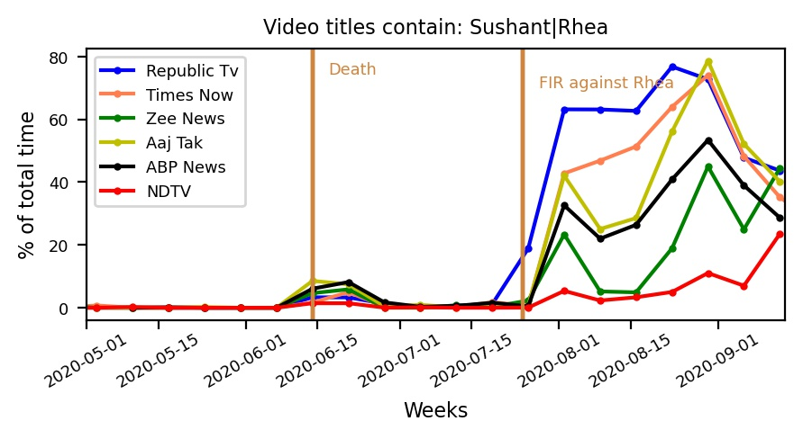
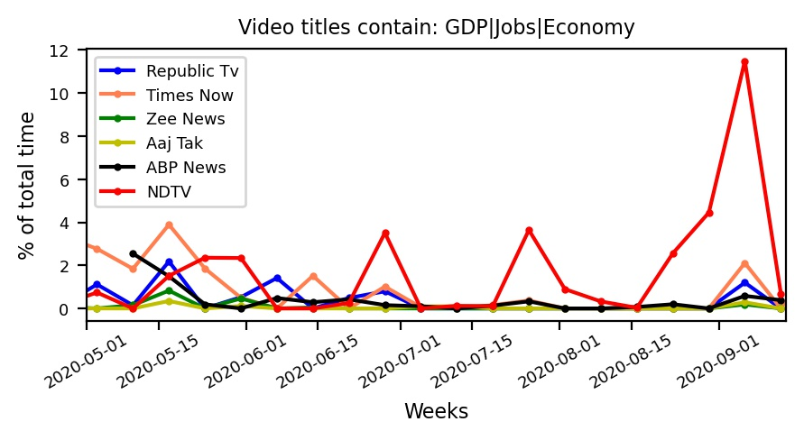
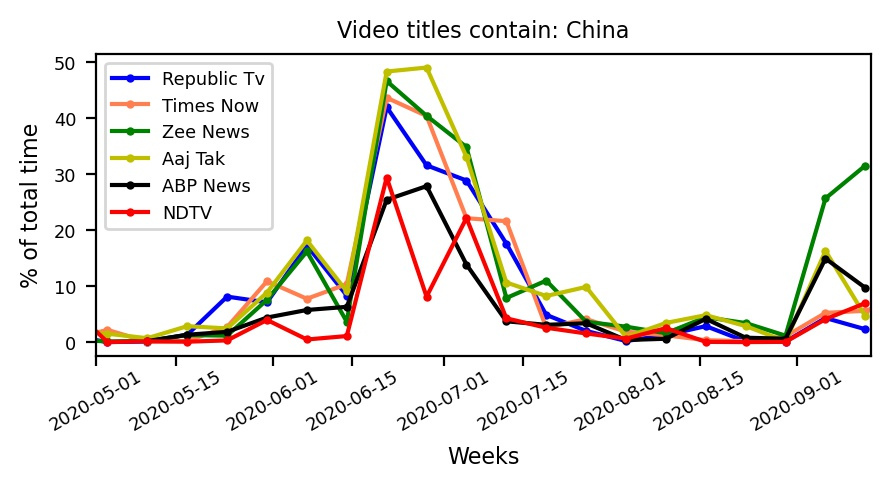
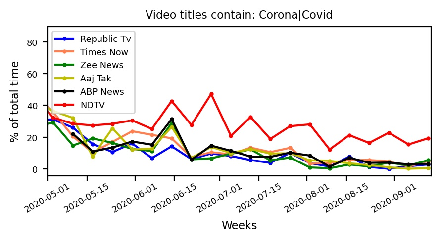

# Indian Media
**Indian news media seems to be biased. Here, we quantify it.**

Our analysis is based on features like duration, title, view count, etc of the videos uploaded on YouTube by different
news channels. Using the data science tools, we look for the keywords related to different news, for example
Sushant|Rhea in Hindi as well as in English, in the video titles. We, then, calculate the total duration of the videos
that have the keywords in their title and the total time for all uploaded videos. The ratio of these two summarized over
different time intervals (weekly, bi-weekly, and monthly) gives us a reasonable quantifier to estimate the coverage a
channel has given to a specific news topic.

We have used our method to quantify the coverage on the Suicide of SSR. We found that Republic TV, Times Now, and Aaj
Tak channels have spent as close as 70% of their time on this topic in time interval spanned from 01 May to 15 Sep 2020.
In contrast, the time spent on topics like economy|GDP|jobs is comparatively less as low as 1-2%. We found similar
trends with other news channels like ABP News, Zee News. NDTV channels seem to have given comparatively better coverage
to the news related to economy|GDP|jobs.

Our code is open for criticism and verification. Please send us an email if you find a bug. You may use the code to
analyze other trends based on the features of videos-uploads for a Youtube channel. 

## Plots

## Additional plots

## Note
I use bitbucket for the version control as It provides free private repositories. If you want to get full development-history for this code, please email me on mail02ankit@gmail.com.

If you use this code, send me a pizza at mail02ankit@gmail.com

## Contributors
[Ankit Kumar](https://mail02ankit.github.io/)
[Anshu Gupta](https://anshu02gupta.github.io/)
